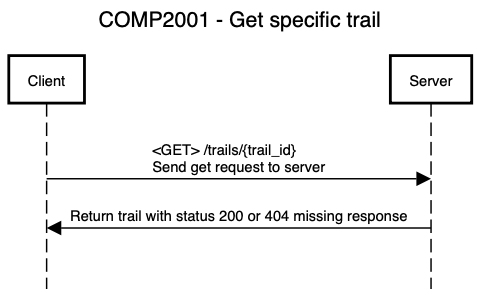

# COMP2001 Report

## Introduction

[**_Web Server_**](http://cent-5-534.uopnet.plymouth.ac.uk/COMP2001/BMannino)

[**_GitHub Repo_**](https://github.com/bobbymannino/comp2001-report)

> ![NOTE]
> add docker link

I have created an API written in python, it enabled all CRUD operations. It manipulates a set of trails that I have stored in a SQL database so they are persistent. I have also documented this API using OpenAPI standards.

In this document you will find documentation for my implementation of the API interface. You will also find a UML diagram for the api, an OpenAPI YAML file, legal, social, ethical and professional concerns and approaches to fix those concerns as well as screenshots of everything working and at the very end an evaluation.

## Background

I had the database basis from the coursework before this one, but there were a couple things that i didnt like or would just like to change anyway. The things ive changed are;

- renamed "order" to "pos" as order is a keyword in SQL
- changed datatype from "text" to "varchar(max)" as text is depreciated
- added "email" property to users table

I wrote the above 2 paragraphs about 2 weeks ago but things have changed since then, I spoke to some people and realised that i have made my database more complicated then it needs to be so i have decided to design it from the bottom up again. I have kept some of the tables as they were but some i have not kept at all or some i have made minor changes to. The new ERD is below;

{ width=400px }

{ width=400px }

{ width=400px }

## Design

## LSEP

## Implementation

## Evaluation

# BELOW ARE THE THINGS I NEED TO WRITE

### Introduction

Provides an introduction to the document and signposts the reader to what they will find in the document.
GitHub link provided. GitHub repo in the correct place (GitHub classroom provided for module).
Link provide to web.socem deployment of micro-service.

### Background

Outline provided for the micro-service. 4
Design Appropriate UML diagrams used.
Clear demonstration of understanding how to design micro-service in place.
Design clearly shows progression of understanding through high level overview through to detail.

### LSEP

Literature used to justify appropriate for information security, privacy, integrity and preservation.
Literature provided using Harvard style referencing.
Appropriate approaches used to meet requirements for a secure, private application.
Data items designed in a way that enforces integrity, privacy and security.

### Implementation

Implementation discussed at appropriate level in report.
Implementation matches code in GitHub classroom and provided design diagrams.
Implementation meets requirements alluded to above (CRUD)
Implementation is RESTful API
Endpoints appropriately represented in documentation, design and implementation.

### Evaluation

Clear evidence of testing provided.
Reflection provided on further work.
Honest reflection provided on weak areas of implementation.

OWASP top 10?
